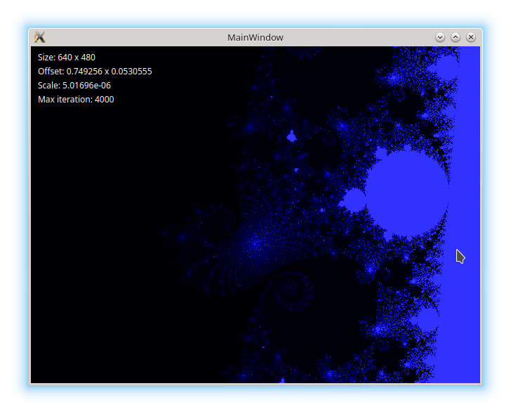
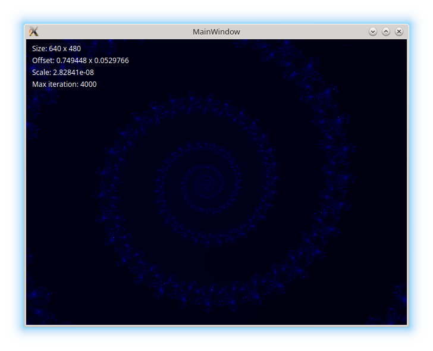

### My Mandelbrot set fractal implementation

### Whats is it?

This Qt Widgets / C++ desktop app draw fractals.

It renders the Mandelbrot set.

### Purpose

To learn parallel programming. To the beauty & art.
